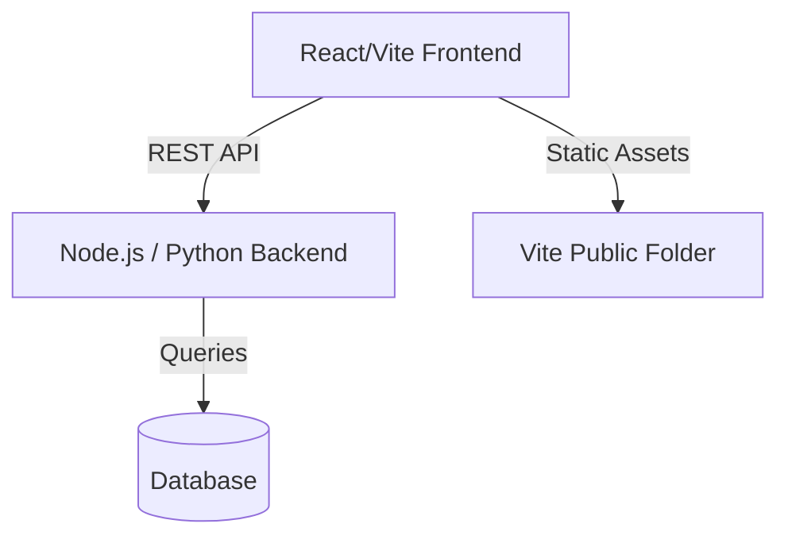
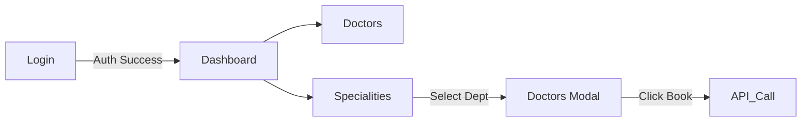

# PROJECT_ANALYSIS_AND_DEVELOPER_HANDOVER.md

---

## SECTION 1: Executive Summary

- **Project Name:** Hospital Website (Pulse Life)
- **Project Purpose:** A modern, premium web portal for a hospital featuring department specialities, doctor directories, an interactive 3D model placeholder, and a dashboard for authenticated users.
- **Current Development Stage:** Frontend UI/UX Prototyping and Implementation (Pre-backend integration).
- **Developer Contribution Summary:** The developer completely overhauled the `DashboardPage`, designed and built a standalone `DoctorsPage` with a responsive grid of 16 specialists, and engineered an advanced `SpecialitiesPage` featuring an interactive placeholder for a 3D anatomical model with glowing UI cards and a sliding modal.
- **Estimated Completion Percentage:** 30% (Frontend UI ~75%, Backend 0%, DB 0%).
- **Major Features Implemented:** React Routing, Authenticated Routes (localStorage based), Dashboard UI, Interactive Specialities Hologram UI, Doctors Directory.
- **Major Features Pending:** Backend API integration, Database schema creation, Real authentication (JWT/OAuth), Appointment Booking logic.

---

## SECTION 2: Developer Work Report

**Completed Work**
- **Dashboard UI Overhaul:** 
  - *Description:* Refined the padding, layout, and visual flow of the Dashboard.
  - *Status:* Completed.
  - *Related Files:* `src/pages/DashboardPage.jsx`
- **Doctors Directory Page:** 
  - *Description:* Created a grid displaying 16 mock Indian doctors with degrees, languages, and profile images.
  - *Status:* Completed.
  - *Related Files:* `src/pages/DoctorsPage.jsx`, `src/App.jsx`
- **Specialities Interactive Page:** 
  - *Description:* Built a page with a 3D model placeholder (using `body.png` with a `mix-blend-multiply` cutout effect) and glowing department cards.
  - *Status:* Completed.
  - *Related Files:* `src/pages/SpecialitiesPage.jsx`, `public/body.png`

**In Progress Work**
- None currently active.

**Pending Work**
- **Backend Booking API:**
  - *Description:* The `handleBookAppointment` function in `SpecialitiesPage.jsx` needs a real API endpoint.
  - *Status:* Pending.

---

## SECTION 3: Development Timeline

- **Initial Setup:** Vite + React + Tailwind environment configured. Routing set up in `App.jsx`.
- **First Features Implemented:** Landing Page, Login, and Blog pages (pre-existing).
- **Recent Changes:** 
  - *Milestone 1:* Dashboard spacing fixed and Mega Menu tested.
  - *Milestone 2:* Created `/doctors` route with 16 cards.
  - *Milestone 3:* Created `/specialities` route with a highly interactive UI for a 3D model and side-panel sliding modal.
- **Last Known Activity:** Removing CSS shadows and applying light theme to the `SpecialitiesPage` to perfectly integrate a background-removed `body.png` image.

---

## SECTION 4: Frontend Analysis

- **Pages Created:** DashboardPage, DoctorsPage, SpecialitiesPage.
- **Components Created:** InteractiveHologram, DoctorCard, BlurFade.
- **Navigation Structure:** `react-router-dom` using `<Router>`, `<Routes>`, and custom `<ProtectedRoute>` wrappers based on `localStorage`.
- **Styling Approach:** Tailwind CSS (utility-first) with inline dynamic classes via `clsx` / `tailwind-merge` (`cn` utility).
- **Responsive Design:** Used Tailwind's `md:`, `lg:` prefixes to ensure grids collapse to single columns on mobile.

**Page Details:**
1. **`/dashboard`**
   - *Purpose:* Main authenticated landing area.
   - *Components Used:* Navbar, Hero, DoctorsSection, MapSection.
   - *Status:* Completed.
2. **`/doctors`**
   - *Purpose:* Comprehensive directory of hospital doctors.
   - *Components Used:* Navbar, DoctorCard.
   - *Status:* Completed.
3. **`/specialities`**
   - *Purpose:* Center of Excellence overview with an interactive 3D asset slot.
   - *Components Used:* Navbar, InteractiveHologram, AnimatePresence Modal.
   - *Status:* Completed UI, waiting on API.

---

## SECTION 5: Backend Analysis

*Note: The following is inferred from frontend placeholders, as no backend code currently exists.*

- **APIs Developed:** None (0).
- **Expected Controllers:** `AppointmentController`, `DoctorController`, `AuthController`.
- **Authentication:** Currently spoofed via `localStorage.getItem('isAuthenticated')`. Needs proper JWT implementation.

**Pending Modules:**
- **Booking Module:** Needs an endpoint (e.g., `POST /api/book`) to accept `doctorId` and `patientId`.

---

## SECTION 6: Database Analysis

*Note: Database has not been initialized. Below is the ASSUMED schema requirement based on frontend data structures.*

- **Database Technology:** TBD (PostgreSQL or MongoDB recommended).
- **Expected Tables / Collections:**
  - `Users` (id, name, email, password_hash)
  - `Doctors` (id, name, speciality, degrees, languages, image_url)
  - `Specialities` (id, name, description, icon_reference)
  - `Appointments` (id, user_id, doctor_id, date, status)

---

## SECTION 7: Project Architecture

**High-Level Architecture (Assumed Future State):**



**Frontend Architecture Flow:**


---

## SECTION 8: Folder & File Structure

```text
hospital-website/
├── public/                 # Static assets
│   └── body.png            # 3D Model image placeholder
├── src/
│   ├── lib/
│   │   └── utils.js        # Tailwind merge utility (cn)
│   ├── pages/
│   │   ├── LandingPage.jsx
│   │   ├── LoginPage.jsx
│   │   ├── DashboardPage.jsx # Dashboard UI
│   │   ├── DoctorsPage.jsx   # Grid of 16 doctors
│   │   └── SpecialitiesPage.jsx # Interactive hologram UI
│   ├── App.jsx             # React Router configuration
│   └── main.jsx            # React root mount
├── package.json            # Dependencies
└── tailwind.config.js      # Styling configuration
```

---

## SECTION 9: File Contribution Report

| File | Purpose | Developer Activity | Status |
|---|---|---|---|
| `App.jsx` | Routing | Added Routes for `/doctors` and `/specialities` | Complete |
| `DashboardPage.jsx` | Dashboard UI | Fixed padding, updated Navbar Links | Complete |
| `DoctorsPage.jsx` | Directory UI | Created from scratch with mock data | Complete |
| `SpecialitiesPage.jsx`| Speciality UI | Created from scratch with interactive `body.png` | Complete |
| `package.json` | Dependencies | Read to verify routing library | Complete |

---

## SECTION 10: Feature Tracking

- [x] Routing Setup
- [x] Mock Authentication (localStorage)
- [x] Dashboard UI
- [x] Doctors Directory UI
- [x] Specialities Interactive UI
- [ ] Backend Appointment Booking API
- [ ] JWT Authentication
- [ ] Database Integration

---

## SECTION 11: API Documentation

*Note: All APIs are currently placeholders awaiting backend development.*

**1. Book Appointment (Placeholder)**
- **Endpoint:** `POST /api/book` (Assumed)
- **Method:** `POST`
- **Purpose:** Books an appointment with a specific doctor.
- **Request:** `{ "doctorId": "d1", "specialityId": "neurology" }`
- **Response:** `{ "status": "success", "bookingId": "123" }`
- **Status:** Pending Backend Implementation.

---

## SECTION 12: Dependencies & Technologies

**Frontend Libraries (Confirmed via package.json):**
- `react` / `react-dom` (^19.2.7)
- `react-router-dom` (^7.18.0)
- `framer-motion` (^12.42.0) - For UI animations.
- `lucide-react` (^1.21.0) - For SVG Icons.
- `tailwindcss` (^4.3.1) - For Styling.
- `clsx` / `tailwind-merge` - For conditional class joining.

**Backend/Database:** Not yet initialized.

---

## SECTION 13: Code Quality & Technical Debt

- **Hardcoded Mock Data:** `DoctorsPage` and `SpecialitiesPage` use hardcoded arrays (`DOCTORS_DATA`, `SPECIALITIES`). These must be replaced with `useEffect` fetches from a backend API.
- **Authentication:** `localStorage.getItem('isAuthenticated')` is used for route protection. This is highly insecure and must be replaced with a real Auth Context and HTTP-Only cookies or JWT tokens.
- **Redundant Navbars:** `DashboardPage`, `DoctorsPage`, and `SpecialitiesPage` each have a local `Navbar` component defined inside the file. 
  - *Refactoring Opportunity:* Extract `Navbar` into `src/components/Navbar.jsx`.

---

## SECTION 14: Remaining Work (Backlog)

**Critical**
- Implement real backend authentication to replace `localStorage` spoofing.
- Create Database schema for Doctors and Specialities.

**High Priority**
- Build the `POST /api/book` endpoint and connect it to the `handleBookAppointment` hook in `SpecialitiesPage.jsx`.
- Extract the `Navbar` component to a shared file to adhere to DRY principles.

**Medium Priority**
- Migrate the hardcoded `DOCTORS_DATA` to a database and fetch dynamically.

---

## SECTION 15: New Developer Handover

**Current Project State:**
The frontend UI is looking exceptional, featuring high-end animations and interactive components. The visual structure for the core authenticated pages (Dashboard, Doctors, Specialities) is complete. 

**What needs immediate attention:**
The project is entirely disconnected from any backend. Your first priority as a backend developer is to look at `src/pages/SpecialitiesPage.jsx` and find the `@BACKEND_TEAM` comment above the `handleBookAppointment` function. This is your entry point to hook up the appointment booking logic.

**Where to start:**
1. Review `App.jsx` to understand the routing.
2. Review the data structures in `DoctorsPage.jsx` and `SpecialitiesPage.jsx` to inform your Database Schema design.
3. Replace the `localStorage` auth in `App.jsx` with your secure implementation.

---

## SECTION 16: Final Assessment

- **Frontend Completion %:** 75%
- **Backend Completion %:** 0%
- **Database Completion %:** 0%
- **Overall Project Completion %:** 30%

**Final Recommendations:** 
Do not add any more complex UI animations until the backend database and API layers are established. The frontend is ready to consume data. Focus 100% of the next sprint on API development and database integration.
